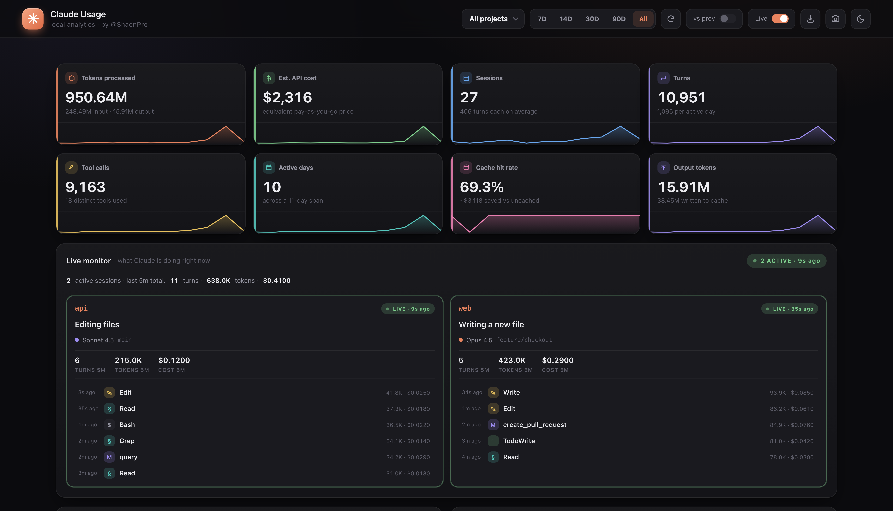
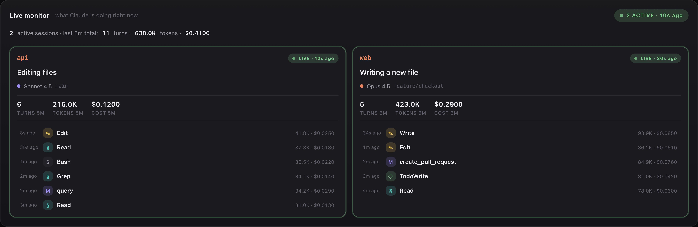
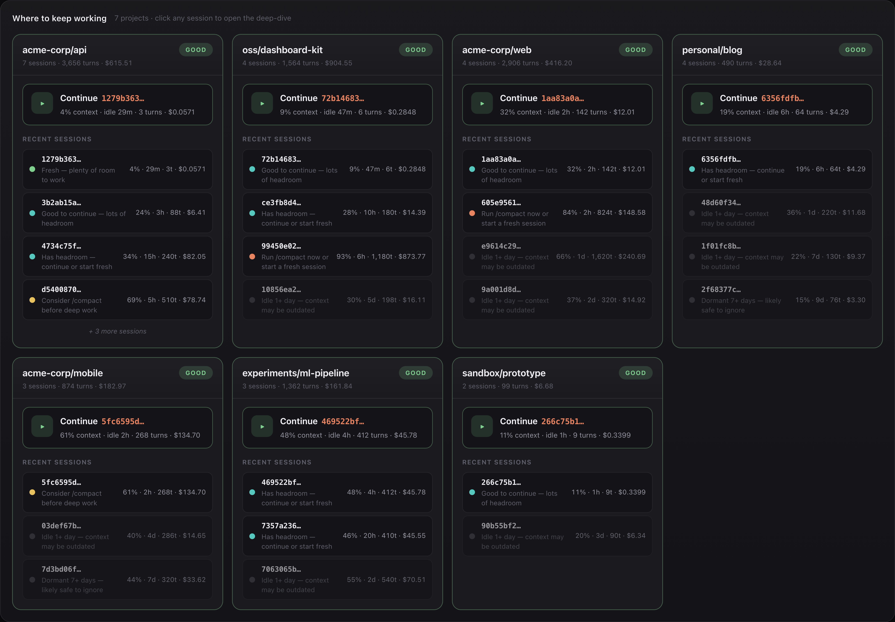
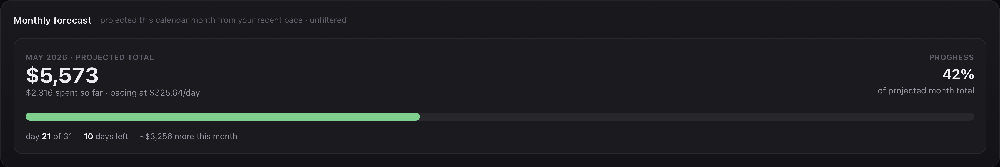
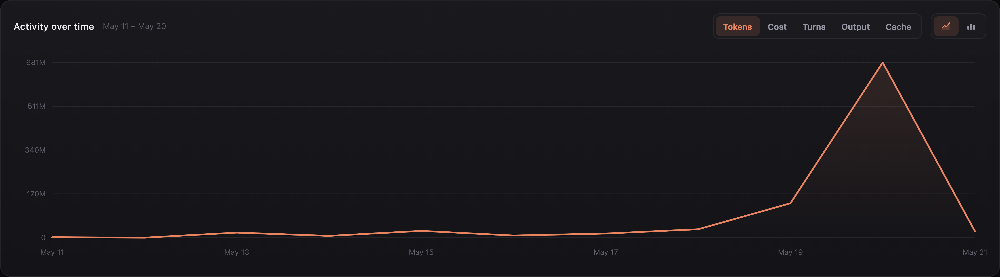
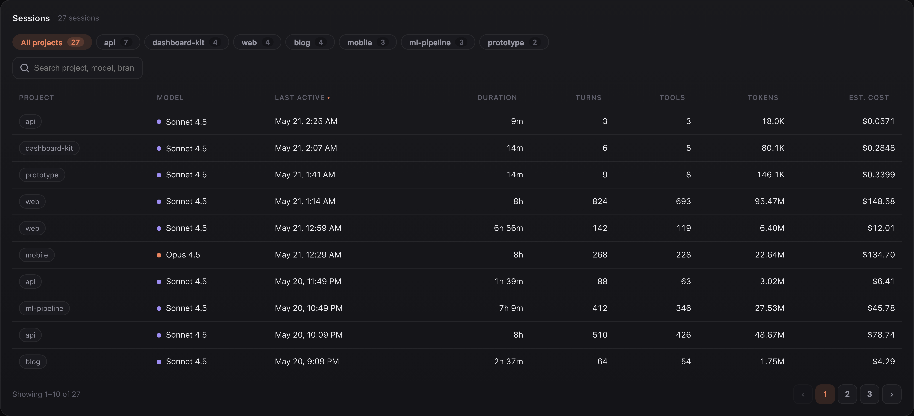
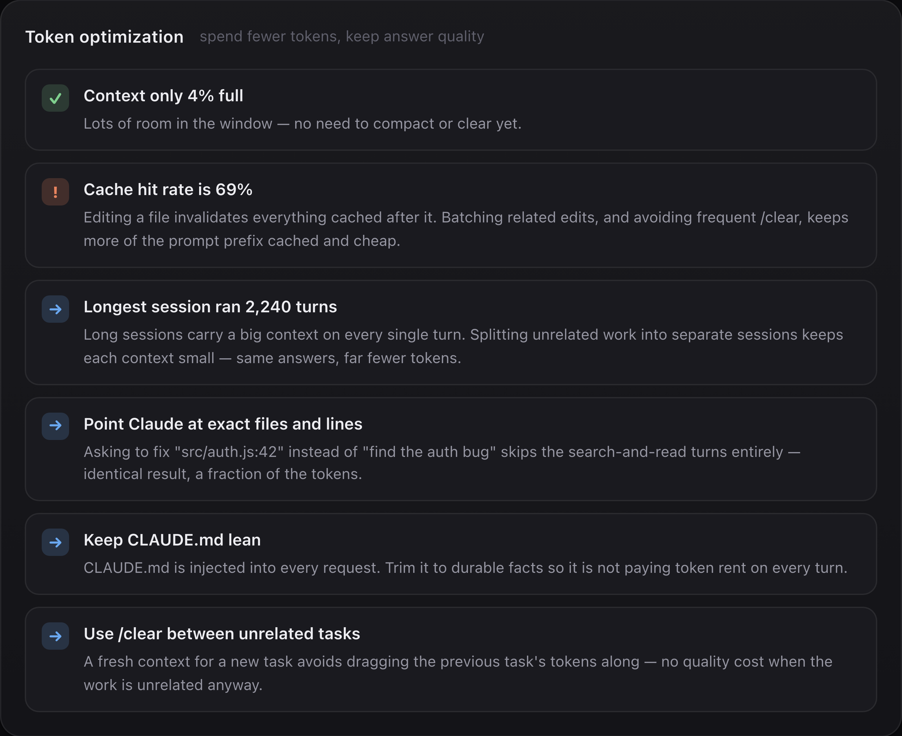
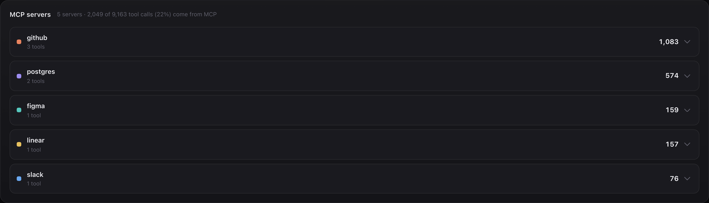

<div align="center">

# ✦ &nbsp; Claude Usage Dashboard

**Premium local analytics for Claude Code** — KPIs, real-time monitor, cost forecast,
session deep-dive, MCP-server breakdown, and a token-saving advisor.
Everything runs on `127.0.0.1`. Your data never leaves your machine.

[](https://nodejs.org)
[](LICENSE)
[]()
[]()

<br/>



</div>

---

## ⚡ &nbsp; One command — plug and play

```bash
npx github:ShaonPro/Token-Usage
```

That's it. The dashboard opens in your default browser at <http://127.0.0.1:47821>.
No clone, no install, no `npm install`. Press **Ctrl + C** to stop.

> **Heads-up** — `npx` will ask once to install. Say yes. Subsequent runs are instant.

### Install once, run anywhere

```bash
npm i -g github:ShaonPro/Token-Usage

claude-usage          # open the web dashboard
claude-usage-cli      # full report right in your terminal
```

Re-run the `npm i -g` command to update — npm refetches by commit hash automatically.

### Or — download and double-click

If you don't use npm, clone or download the repo and double-click the launcher for
your OS:

| OS      | Launcher                          |
| ------- | --------------------------------- |
| macOS   | `claude-usage.command` *(right-click → Open the first time)* |
| Windows | `claude-usage.bat`                |
| Linux   | `./claude-usage.sh`               |

### Requirements

- **Node.js 22.5+** &nbsp;—&nbsp; uses Node's built-in `node:sqlite`, **no `npm install` ever needed**.
- **Claude Code** installed and used at least once, so `~/.claude/` exists.

---

## 🚀 &nbsp; What you get

### Live monitor — what Claude is doing right now

Real-time view of every active Claude Code session, parsed straight from the
JSONL transcripts (`~/.claude/projects/`). Multi-session aware — if you're
running two windows at once, you see them side-by-side, with last-5-minute
turn / token / cost rollups and the most recent tool calls.



### Token-saving advisor — which session to keep, which to abandon

Every project gets a session health audit. Color-coded states
(`fresh` · `healthy` · `getting-full` · `near-max` · `stale` · `abandoned`)
plus a concrete next move: which session to **continue**, which to `/compact`,
which to retire for a fresh start.



### Monthly cost forecast

Knows how many days are left in the month and your recent burn rate.
Tells you the projected end-of-month total before you blow the budget.



### Activity over time

Switchable across **Tokens · Cost · Turns · Output · Cache**, area or bar.
Hover anywhere on the curve for an exact per-day breakdown.



### Sessions table — sortable, searchable, paginated

Every session you've ever run, sorted by recency by default. Filter by
project chip, full-text search across project/model/branch, sort any column,
click any row to open a **deep-dive modal** with per-turn context-size
timeline and tool breakdown.



### Token optimization — fewer tokens, same answers

Context-aware tips: how full the current window is, whether the cache hit
rate is healthy, when to `/compact` vs `/clear`, and durable habits
(point at exact files, keep `CLAUDE.md` lean, split unrelated tasks).



### MCP server breakdown

See exactly which MCP servers your turns hit, with per-tool drill-down.



---

## 🖥️ &nbsp; Terminal mode

```bash
claude-usage-cli                          # everything, all time
claude-usage-cli --range 7d               # last 7 days  (7d | 14d | 30d | 90d | all)
claude-usage-cli --project acme-corp/api  # filter to one project
claude-usage-cli --json                   # raw JSON, pipe-friendly
```

*(Or `node cli.js --range 7d` if you didn't install globally.)*

The CLI renders the same KPIs, model/project rankings, top tools,
daily sparkline, and insights with proper ANSI color — perfect for CI logs
or when you don't have a browser handy.

---

## ⚙️ &nbsp; Configuration

| Env var      | Effect                                                                  |
| ------------ | ----------------------------------------------------------------------- |
| `PORT`       | Pick a different port. Auto-tries the next 10 if `47821` is busy.       |
| `NO_OPEN`    | Set to anything truthy to skip auto-opening the browser.                |
| `HOST`       | Override the bind address. Default `127.0.0.1` — **leave it loopback**. |
| `CLAUDE_USAGE_DB` | Point at a different SQLite DB (useful for demos / multiple installs). |

Examples:

```bash
PORT=8090 npx github:ShaonPro/Token-Usage         # custom port
NO_OPEN=1 npx github:ShaonPro/Token-Usage         # don't auto-open browser
```

---

## 🔒 &nbsp; Privacy

- Binds to **`127.0.0.1` only** — the dashboard is **not reachable from your network**.
- Database is opened **read-only**. We never write to `~/.claude/usage.db`.
- **Zero external runtime dependencies** — no `npm install`, no CDN fetches at runtime.
- **No telemetry, no analytics, no tracking pixels.** Nothing phones home.
- Cost numbers are estimated **Anthropic API list prices**, not your Claude Code
  subscription bill — shown so you can see the dollar value of the work
  you ran locally.

---

## 🏗️ &nbsp; How it works

```
server.js          Local HTTP server + JSON API (binds to 127.0.0.1)
stats.js           Reads ~/.claude/usage.db + JSONL files, applies pricing,
                   aggregates, classifies session health
dashboard.html     Single-page web UI — vanilla JS, custom SVG charts,
                   no CDN, no build step
cli.js             ANSI-colored terminal dashboard
claude-usage.*     One-click launcher per OS
```

The dashboard polls **two endpoints**:

- `GET /api/stats` every 30 s — the heavy aggregates (KPIs, charts, sessions)
  derived from `~/.claude/usage.db`.
- `GET /api/live` every 5 s — the **Live Monitor** reads the most-recently-
  modified `.jsonl` file in `~/.claude/projects/` directly, so it's fresh
  within seconds (the SQLite cache rebuilds on a much slower schedule).

Per-session deep-dive uses `GET /api/session/:id` and parses just that
session's turns.

### Share any card as an SVG

Hover any card → click the camera icon → pick one of six gradient
backgrounds → get a Mac-window-framed SVG with a low-key watermark.
Open the `.svg` in Preview / Photoshop / Figma to export to PNG at
any resolution.

SVG is chosen for lossless quality, modern-CSS fidelity (`color-mix`,
`oklab`, `color(srgb …)` all render perfectly), and tiny file size.

---

## 🧪 &nbsp; Demo mode

Want to try it without your own data?

```bash
git clone https://github.com/ShaonPro/Token-Usage
cd Token-Usage
node scripts/seed-demo.js                # writes demo-usage.db
node scripts/demo-server.js              # runs against demo data on :47831
```

All the screenshots above were captured from this demo seed — believable
fake projects, costs, and session health states, no real data exposed.

---

## 📦 &nbsp; What's in the repo

| File                         | Purpose                                          |
| ---------------------------- | ------------------------------------------------ |
| `server.js`                  | Local HTTP server                                |
| `stats.js`                   | SQLite + JSONL data layer, pricing, aggregation  |
| `dashboard.html`             | Single-page web UI                               |
| `cli.js`                     | Terminal dashboard                               |
| `claude-usage.command/.bat/.sh` | One-click launchers per OS                    |
| `scripts/seed-demo.js`       | Generate `demo-usage.db` with believable dummy data |
| `scripts/demo-server.js`     | Demo server (stubs `/api/live` with canned data) |
| `scripts/capture-screenshots.js` | Headless Chrome screenshot capture           |

---

## 📄 &nbsp; License

MIT — see [LICENSE](LICENSE).

<div align="center">
<br/>

✦ &nbsp; Customized by **[ShaonPro](https://github.com/ShaonPro)** &nbsp; ✦

</div>
